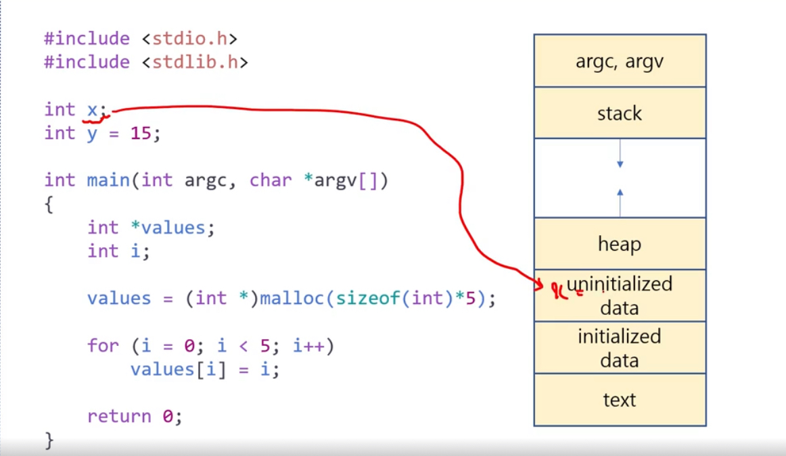
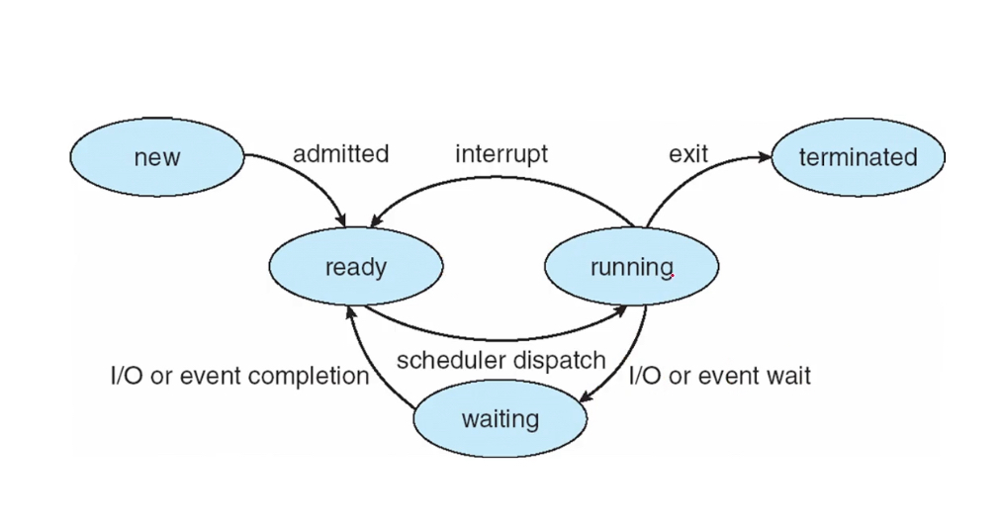
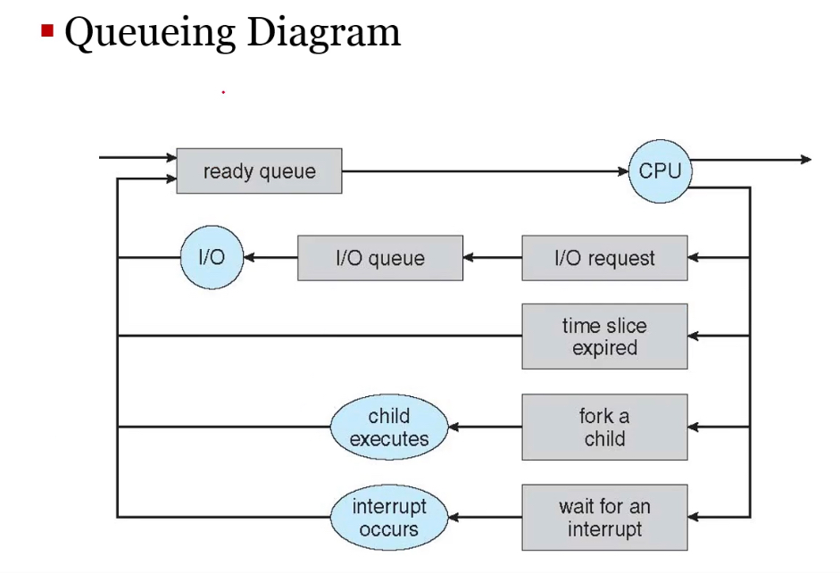
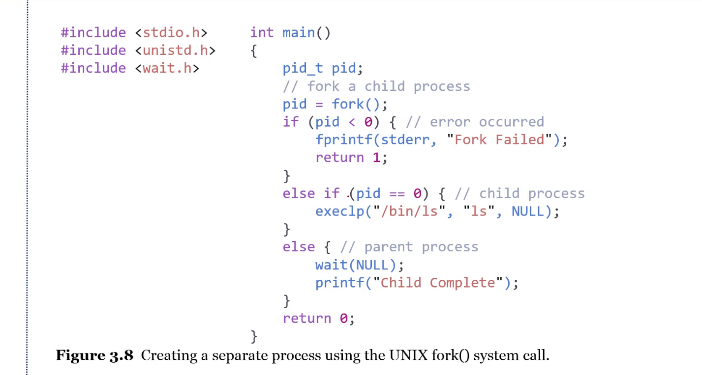

# 프로세스의 이해.

## 프로세스

- 프로세스란 “실행 중인 프로그램“이다.
- 프로세스를 완료하기 위해서는 자원이 필요하다.
    - CPU (연산)
    - 메모리 (명령 및 데이터 저장)
    - 파일 (프로세스의 내용이 저장되어 있어야함.)
    - I/O 장치 (데이터가 출력되어야 함.)
    
## 메모리 영역.

> [!note]
> - 크게 text, data, heap, stack으로 나눌 수 있다.
> - data의 경우 초기화 여부에 따라서 구역이 나뉜다.




- Text
    - 실행 가능한 코드가 저장됨.
- Data
    - 전역 변수 등의 데이터가 저장.
    - 초기화 여부에 따라서 initialized와 uninitialized로 갈림.
- Heap
    - 프로그램이 동작하는 동안 동적으로 메모리가 할당되는 곳.
- Stack
    - 함수 등이 실행되었을 때 임시적으로 데이터가 저장되는 곳.
    - 매개변수, 반환 주소, 지역 변수 등.
- argc, argv
    - main 함수의 매개변수.

## 프로세스 상태.
> [!note]
> - 프로세스는 new, ready, running, waiting, terminated로 나뉜다.
> - 이 상태는 프로세스를 관리하며 운영체제가 PCB에 저장해준다.
> - 기본적으로 new → ready → running → terminated로 흘러간다고 생각하면 됨.
> - waiting은 I/O 작업 때문에 프로세스를 진행하는 것이 불가능한 경우에 해당함. (*큐도 따로 씀.)



- New
    - 새로 생성된 상태.
    - 이를 PCB를 생성하는 것으로 볼 수도 있음.
- Running
    - 프로세스의 데이터가 CPU를 점유해 작동 중인 상태.
- Waiting
    - I/O 작업 완료 등을 기다리는 상태.
    - I/O 작업이 끝나면 ready 상태가 된다.
- Ready
    - CPU를 점유하기 위해 대기 중인 상태.
- Terminated
    - 작업이 종료되어 프로세스가 끝난 상태.

## PCB(Process Control Block)

- 프로세스는 운영체제 내부에서 PCB에 의해 표현된다.
    - ⇒ 운영체제가 프로세스에 대한 데이터를 저장하고 관리한다.
- 프로세스와 관련된 정보들이 담긴 구조체(struct)
    - 프로세스 상태(process state)
    - 프로그램 카운터(program counter)
        - 프로세스는 명령의 집합이고, 프로세스가 다음에 실행할 명령어의 주소가 프로그램 카운터이다.
        - CPU 안의 레지스터의 이름이기도 함.
            - 일반적으로 프로그램 카운터는 순차적으로 증가하지만, 강제로 프로그램 카운터를 바꾸는 명령어도 존재한다.
    - 레지스터 정보(CPU register)
        - 레지스터에 데이터들을 담아두고 작업하기 때문.
- 운영체제는 프로세스를 관리해야하므로, 여기에 필요한 모든 데이터가 들어가있다고 보면 된다.
- 원래 프로세스는 단일한 실행 흐름이었다. 그러나 프로세스 내부에서도 다중 실행이 필요하게 되었음.
    - 이렇게 생겨난 것이 멀티 스레드.

## 멀티 프로세싱.

- 잦은 프로세스 처리 변경(time sharing)을 통해서 마치 동시에 실행되는 것처럼 사용자가 느끼게하는 것이 목적.

## 스케줄링 큐(Scheduling Queues)

[!note]
- 운영체제는 스케줄링 큐를 이용해서, 다양한 프로세스를 시분할해서 처리할 수 있다. → 멀티 프로세싱.
- 크게 ready queue와 I/O queue(wait queue) 가 있다.




- 선입 선출 구조.
- CPU를 사용하기 위해 대기 중인 프로세스들.
- Ready Queue와 Wait Queue가 존재함.
- 만일 I/O 작업을 기다리는 경우에는 Wait Queue에서 처리를 기다리다가 Ready Queue로 들어간다.
- 이러한 큐는 일반적으로 PCB로 이루어진 Linked List로 구현.

## 문맥 교환.

<aside>
⚠️

- 시분할(time sharing)의 핵심.
- PCB를 이용하여 프로세스의 상태를 저장하기 때문에 문맥 교환(context switch)이 가능하다.
</aside>

- 프로세스가 사용되고 있는 상태를 문맥이라 볼 수 있다. ⇒ PCB
    - 다양한 프로세스의 전환은 PCB가 존재하기 때문에 가능하다.
- Queue를 처리하면서, 운영체제는 PCB를 저장하고 복원한다.
    - 이를 문맥 교환(context switch)이라고 표현한다.

# 프로세스의 생성.

## 프로세스의 생성.

<aside>
⚠️

- pork(); 시스템 콜을 통해서 가능하다.
- 프로세스는 부모 프로세스의 상태를 완전히 복사한 뒤에 다음 명령을 실행한다.
- 자식 프로세스의 pid는 0이라고 출력된다. 그러나 실제로는 할당된 pid가 존재.
- 자식 프로세스의 text를 덮어씌워서 원래의 동작과 다른 동작을 실행하는 것도 가능하다.
- 전역 변수건 지역 변수건 모두 복사한다. 부모와 자식의 메모리 공간은 완전히 다르다.
</aside>



- 일반적으로 프로세스는 생성되는 순간에 실행에 필요한 코드, 데이터, 힙, 스택 등의 공간이 메모리에 할당된다. 그리고 PCB를 생성한다.
    - 이 때 할당된 공간은 어디까지나 해당 프로세스만을 위한 공간이다.
- 
- 프로세스는 프로세스를 만드는 것이 가능하다.
- 따라서 하나의 루트 프로세스가 하위 프로세스를 가동하는 식의 구조가 가능하다.
    - 즉 부모 프로세스와 자식 프로세스가 존재할 수 있는 것.
- **실행할 때 발생할 수 있는 두 경우.**
    - 부모 프로세스가 자식 프로세스와 무관하게 비동기적으로 실행되는 경우
    - 자식 프로세스의 작동을 기다리며 동기적으로 실행되는 경우
- **주소 공간을 사용할 때 발생할 수 있는 두 경우.**
    - 자식 프로세스가 부모 프로세스와 주소를 공유.
    - 자식 프로세스가 부모 프로세스와 별개의 주소에 로드.

## 자식 프로세스의 생성.

- 프로세스는 프로세스를 생성할 수 있다. 이 때 생성된 프로세스를 자식 프로세스라고 한다.
    - fork(); 라는 시스템 콜을 통해서 생성한다.
    - wait(); 를 이용해서 자식 프로세스의 return을 기다리는 것도 가능하다.
    - 자식 프로세스는 부모 프로세스의 주소 공간을 완전히 복사한다.
    - 이 때 자식 프로세스의 pid는 0이다. fork();를 했을 때 부모와 자식을 구분하기 위함.
- 자식 프로세스는 부모 프로세스와 독립해서 완전히 별개의 코드를 실행하는 것도 가능하다. (*execlp();)
- 프로세스가 실행 중에 자식 프로세스를 만들면, 정확히 자식 프로세스는 어느 지점에서 실행되는가?
    - fork();를 한 다음 줄부터 실행된다.

## 프로세스의 종료.

<aside>
⚠️

- 코드가 끝나면 terminated 된다. 이 경우 PCB에 적은 데이터만 남게 된다.
- 좀비 프로세스는 부모가 제대로 wait();등의 시스템콜로 종료된 자식 프로세스를 회수하지 않은 것.
- 고아 프로세스는 부모가 terminated 되었음에도 계속 실행되고 있는 자식 프로세스.
</aside>

- 코드가 끝나면 자동으로 끝남.
- 혹은 exit(); 시스템 콜을 통해서 종료해줄 수 있음.
- 좀비와 고아 프로세스.
    - 좀비 프로세스는 부모 프로세스가 wait();를 호출하지 않고 종료된 자식 프로세스.
        - ⇒ 즉, 종료는 되었으나 처리가 안 됨.
    - 고아 프로세스는 부모 프로세스가 wait();를 하지 않고 부모가 먼저 종료되어버린 프로세스.
        - ⇒ 부모와는 무관하게 계속 작동함.

** 코드는 굳이 IDE를 이용하지 않아도 셸을 이용해서 컴파일하는 것이 가능하다. 그 이유는 컴파일러도 프로그램일 뿐이기 때문.

## 부모 및 자식 프로세스의 실행 순서.

<aside>
⚠️

- 서로 다른 프로세스의 실행은 동기적이지 않다.
- CPU 스케줄링 상황에 따라서 실행 순서가 달라질 수 있다.
</aside>

- 부모 및 자식의 프로세스의 실행 순서는 일정하지 않다.
    - ⇒ CPU의 스케쥴링에 따라 결정됨.
- 부모 및 자식 프로세스가 번갈아가면서 실행될 수도 있다는 것.
- ⇒ 이에 따라서 동기화 프로그래밍이 필요해질 것.

# 프로세스간 통신(IPC, inter-process communication)

<aside>
⚠️

- 프로세스 간에 통신이 필요할 때, 크게 “공유 메모리”, “메세지함” 방식을 사용한다.
</aside>

- 프로세스는 독립적으로 실행될 수도 있고, 상호작용하면서 실행될 수 있다.
    - 상호작용한다는 말은 특정 자원을 공유한다는 의미임.
    - 그러나 상호작용하는 경우 결과를 예측하기 어려울 수 있음.
- 공유 메모리를 이용하는 방법과 메세지를 주고 받는 방법 크게 2가지 방법이 있다.
- 공유 메모리를 이용하는 방법은 말 그대로 메모리를 공유.
- 메세지를 주고 받는 경우 운영체제를 이용한다.

## 생산자-소비자 문제(producer-consumer problem)

- 생산자는 정보를 제공하는 측.
- 소비자는 정보를 소비하는 측.
- 공유 메모리(shared-memory)를 이용하는 경우.
    - 생산자는 버퍼(buffer)에 채우고
    - 소비자는 버퍼를 비운다.

## 공유 메모리 구현.

<aside>
⚠️

- shared buffer를 만든다. 두 프로세스가 모두 접근할 수 있는 메모리 공간이다.
- 생산자는 shared buffer에 데이터를 싣고, 소비자는 shared buffer에 데이터를 가져온다.
    - 순환 큐(circler queue)로 구현.
</aside>

## 생산자측 버퍼 구현 예제.

```c
#include <stdio.h>
#include <stdbool.h>

#define BUFFER_SIZE 10

// 아이템을 나타내는 구조체
typedef struct {
    // 필요한 데이터 필드를 여기에 추가하세요
    int data;
} item;

// 버퍼와 관련된 변수들
item buffer[BUFFER_SIZE];
int in = 0;
int out = 0;

void producer() {
    item next_produced;

    while (true) {
        /* produce an item in next_produced */
        next_produced.data = rand() % 100; // 임의의 데이터를 생성했다고 가정

        // 버퍼가 가득 찬 경우 대기
        while (((in + 1) % BUFFER_SIZE) == out)
            ; /* do nothing, busy wait */

        // 버퍼에 아이템 저장
        buffer[in] = next_produced;
        in = (in + 1) % BUFFER_SIZE;
    }
}

```

## 소비자측 버퍼 구현 예제.

```c
#include <stdio.h>
#include <stdbool.h>

#define BUFFER_SIZE 10

// 아이템을 나타내는 구조체
typedef struct {
    int data;
} item;

// 버퍼와 관련된 변수들 (생산자와 공유되는 변수)
extern item buffer[BUFFER_SIZE];
extern int in;  // 생산자가 데이터를 저장하는 위치
extern int out; // 소비자가 데이터를 읽는 위치

// 소비자 함수
void consumer() {
    item next_consumed;

    while (true) {
        // 버퍼가 비어있으면 대기
        while (in == out)
            ; /* do nothing, busy wait */

        // 버퍼에서 아이템을 소비
        next_consumed = buffer[out];
        out = (out + 1) % BUFFER_SIZE;

        /* consume the item in next_consumed */
        printf("Consumed: %d\n", next_consumed.data);
    }
}
```

## 공유 메모리의 문제점.

- 이를 일일이 프로그래머가 구현해줘야하기 때문에 혼잡해질 수 있음.
- 그러니 운영체제가 이 역할을 대신하는 것.

## 메세지 전달 방식.

<aside>
⚠️

- shared buffer를 선언하고, 주소를 이용해서 다른 프로세스들이 접근할 수 있게 만든다.
</aside>

```c
// 버퍼 크기 정의
#define BUFFER_SIZE 10

// 메시지 구조체 정의
struct message {
    int item;
}

// 메시지 큐 정의
queue message_queue = create_queue(BUFFER_SIZE);

// 생산자 프로세스
process producer() {
    message msg;
    while (TRUE) {
        // 데이터 생성
        msg.item = produce_item();

        // 메시지 큐가 가득 찼으면 대기
        if (is_full(message_queue)) {
            wait(); // 큐가 가득 차면 대기
        }

        // 생성한 데이터를 메시지 큐에 보냄
        send(message_queue, msg);

        // 소비자에게 처리할 수 있다는 신호
        signal(consumer);
    }
}

// 소비자 프로세스
process consumer() {
    message msg;
    while (TRUE) {
        // 메시지 큐가 비어 있으면 대기
        if (is_empty(message_queue)) {
            wait(); // 큐가 비었으면 대기
        }

        // 메시지 큐에서 데이터를 받음
        receive(message_queue, msg);

        // 받은 데이터를 처리
        consume_item(msg.item);

        // 생산자가 데이터를 넣을 수 있다는 신호
        signal(producer);
    }
}

// 메인 프로세스
process main() {
    // 프로세스 생성
    create_process(producer);
    create_process(consumer);

    // 시스템 동작을 모니터링하는 루프
    while (TRUE) {
        monitor_system();
    }
}

```

- 근본은 공유 메모리이지만, 이를 운영체제가 관리하는 형태.
- 프로세스 측에서는 send, receive 시스템 콜만을 사용해서 처리.

## 메세지 전달 링크

<aside>
⚠️

- 메세지함이라는 공유 버퍼를 만들어서 여기에 프로세스들의 데이터를 담을 수 있게 해주는 것.
- 주로 이걸 운영체제가 만들어서 관리함.
</aside>

- 직접 전송, 간접 전송.
- 동기적, 비동기적.
- 자동, 명시적 버퍼링.

- 직접 전송
    - 각 프로세스가 통신을 원한다.
    - 그에 따라 수신자 및 발신자의 이름을 명시해야한다.
    - send(P, message)
    - receive(Q, message)
    - 링크는 자동적으로 생성되고, 정확히 프로세스(P, Q) 2개 사이의 통신이다.
- 간접 전송.
    - mailbox, port등에 데이터를 쌓아두고, 가져가는 방식.
    - 생산자는 저장을 해야할 수 있고, 소비자는 지울 수 있다.
    - send(A, message)
    - receive(A, message)
    - 여기서 A는 저장소의 이름. 오직 두 프로세스가 저장소를 공유할 때에만 링크가 성립함.
    - 또한 2개 이상의 프로세스들이 이에 참여할 수 있음. 따라서 많은 수의 링크가 성립할 수 있음.
- OS의 역할.
    - 메일 박스 만들기 및 삭제.
    - 메일 박스 안의 데이터 입출력 구현.
    - 이 메일박스를 port라고 부를 수 있음.
        - 즉 자원을 해당 장소에 놓겠다는 약속으로 볼 수 있을 듯.

## 다양한 구현 옵션.

<aside>
⚠️

- 블록킹과 논블록킹을 각각 발신과 수신에 적용할 수 있음.
- 주로 논블록킹 방식 같은 경우에는 mailbox 방식을 사용 함.
</aside>

- 블록킹 혹은 논블록킹 ⇒ 동기, 비동기 I/O
    - 여기서 블록킹(blocking)이란 코드 흐름이 해당 작업 때문에 막히느냐? 아니냐?라고 생각해도 될 거임.
- 블록킹 전송(blocking send)
    - 메세지를 소비자가 받을 때까지 대기.
- 논블록킹 전송(non-blocking send)
    - 메세지를 전송 후 다시 돌아감. OS에 이 데이터를 관리하게 하는 것.
- 블록킹 수신(block receive)
    - 다 받을 때까지 대기함.
- 논블록킹 수신(non-blocking receive)
    - 그 때 그 때 존재하는 메세지를 받아옴. 메세지의 수신 여부와 무관하게 작업을 계속함.

# 프로세스간 통신의 실제.

## IPC 사례

<aside>
⚠️

- 프로세스 간의 통신의 실제 예시로는 POSIX 공유 메모리 및 파이프가 존재한다.
</aside>

- 공유 메모리는 POSIX Shared Memory
    - portable operating system interface (for unix)
    - os 표준화를 목표.
- 메세지 전달은 Pipes를 볼 것이다.
    - 유닉스 시스템에서 기본적으로 사용하는 방법.

## POSIX 공유 메모리.

<aside>
⚠️

- memory-mapped file을 통해 구현.
- OS를 통해 파일에 접근(읽기, 쓰기) 함.
- 모든 프로세스가 이용할 수 있음.
</aside>

- 공유 메모리를 이용한 코드여서, 생산자와 소비자 측의 코드를 모두 실행해줘야 함.
    - 즉 두 프로세스가 실행되어야 하는 것.
- 메모리 memory-mapped file을 만듬.
    - 즉, 공유 메모리를 마치 파일처럼 관리 함.
- mmap을 이용해서 메모리 포인터를 현재 프로세스 포인터에 맵핑.
    - OS가 메모리에 접근 후 fd를 반환, fd를 이용해서 공유 메모리를 조회.
    - 그에 따라서 공유 메모리의 접근 권한은 OS에 있음.
    

### 생성자 측.

```c
#include <stdio.h>
#include <stdlib.h>
#include <sys/mman.h>
#include <sys/stat.h>        /* For mode constants */
#include <fcntl.h>           /* For O_* constants */
#include <unistd.h>          /* For ftruncate */
#include <string.h>

int main() {
    const char *name = "shared_memory_example";  // 공유 메모리 이름
    const int SIZE = 4096;                       // 공유 메모리 크기

    int shm_fd;  // 공유 메모리 파일 디스크립터
    void *ptr;   // 메모리 매핑 포인터

    // 공유 메모리 객체 생성 (읽기/쓰기 허용)
    shm_fd = shm_open(name, O_CREAT | O_RDWR, 0666);
    if (shm_fd == -1) {
        perror("shm_open failed");
        exit(1);
    }

    // 공유 메모리 크기 설정
    if (ftruncate(shm_fd, SIZE) == -1) {
        perror("ftruncate failed");
        exit(1);
    }

    // 공유 메모리 영역을 현재 프로세스 주소 공간에 매핑
    ptr = mmap(0, SIZE, PROT_READ | PROT_WRITE, MAP_SHARED, shm_fd, 0);
    if (ptr == MAP_FAILED) {
        perror("mmap failed");
        exit(1);
    }

    // 공유 메모리에 데이터 쓰기
    const char *message = "Hello, Shared Memory!";
    sprintf(ptr, "%s", message);
    printf("Written to shared memory: %s\n", (char *)ptr);

    // 메모리 매핑 해제 및 공유 메모리 삭제 (다른 프로세스에서 수거하지 않도록)
    if (munmap(ptr, SIZE) == -1) {
        perror("munmap failed");
        exit(1);
    }
    if (shm_unlink(name) == -1) {
        perror("shm_unlink failed");
        exit(1);
    }

    return 0;
}
```

### 소비자 측.

```c
#include <stdio.h>
#include <stdlib.h>
#include <fcntl.h>
#include <sys/mman.h>
#include <sys/stat.h>
#include <unistd.h>
#include <string.h>

int main() {
    const char *name = "/my_shm";  // 공유 메모리 객체 이름
    const int SIZE = 4096;         // 공유 메모리 크기

    // 공유 메모리 객체 열기
    int shm_fd = shm_open(name, O_RDONLY, 0666);
    if (shm_fd == -1) {
        perror("shm_open");
        exit(EXIT_FAILURE);
    }

    // 공유 메모리를 읽기 전용으로 매핑
    void *ptr = mmap(0, SIZE, PROT_READ, MAP_SHARED, shm_fd, 0);
    if (ptr == MAP_FAILED) {
        perror("mmap");
        exit(EXIT_FAILURE);
    }

    // 공유 메모리에서 데이터 읽기
    printf("Consumer read: %s\n", (char*)ptr);

    // 공유 메모리 객체 삭제.
    shm_unlink(name);

    return 0;
}

```

## Pipes

<aside>
⚠️

- ordinary Pipe와 Named Pipe가 존재.
- 파일 시스템을 이용하는 것은 동일함.
- 파일 시스템의 read, write를 이용해서, 프로세스 간에 단방향 통로를 구현.
    - 양방향 같은 경우에는 단방향 통로를 2개 만들어서 구현.
- 생산자와 소비자 관계를 위해서 고의적으로 fd의 입출력을 닫음.
</aside>

- 초창기 유닉스 시스템에서 사용한 방법.
- 두 프로세스가 통신하는 도관 역할을 함.
    - 읽기 끝, 쓰기 끝을 가지고 있다.
    - 이를 File Descriptor를 이용해서 표현.
- Pipe 구현의 4가지 이슈.
    - 파이프를 단방향으로 만들어야하는가? 양방향으로 만들어야하는가?
        - ⇒ 단방향으로.
    - 양방향 통신 시에 수신과 발신이 동시에 이루어지게 하느냐, 그렇지 않느냐.
    - 통신하는 프로세스 사이에 어떤 관계가 존재해야만 하는가?
        - 일례로 부모-자식.
    - 네트워크에서 동작할 수 있는가?
        - 네트워크에서는 소켓(socket)을 사용한다.
- 프로세스와 파일 디스크립터
    - 각각의 프로세스는 파일 디스크립터 테이블과 파일 테이블을 지닌다.
    - 파일 디스크립터 배열은 파일 테이블을 가리킨다.
- Pipe의 종류.
    - Ordinary Pipe
        - 부모 및 자식 관계 같은 경우에만 사용 가능하다.
        - 생산자와 소비자가 정해져있다. 단방향만 가능.
        - 관계 없는 외부에서는 접근이 불가능.
            - 파일 디스크립터를 통한 접근이 이루어지기 때문에, 파일 디스크립터의 공유가 되지 않는 외부에서는 접근이 어려움.
        - 사실 얼마든지 예외는 가능하지만, 원활한 통신을 위한 규칙이라고 생각해야할 듯.
    - Named Pipes
        - 이름 있는 파이프, 외부에서 접근이 가능.
        - 양방향 통신이 가능하다.

- 예제

```c
#include <stdio.h>
#include <unistd.h>
#include <string.h>

#define READ_END  0           // 파이프의 읽기 끝
#define WRITE_END 1           // 파이프의 쓰기 끝
#define BUFFER_SIZE 20        // 버퍼 크기 정의

int main() {
    int fd[2];                // 파이프의 파일 디스크립터 (fd[0]: 읽기, fd[1]: 쓰기)
    pid_t pid;
    char write_msg[BUFFER_SIZE] = "Hello, World!";  // 쓰기 버퍼
    char read_msg[BUFFER_SIZE];                     // 읽기 버퍼

    // 파이프 생성
    if (pipe(fd) == -1) {
        fprintf(stderr, "Pipe failed");
        return 1;
    }

    // 프로세스 생성
    pid = fork();

    if (pid < 0) {  // fork 실패 시
        fprintf(stderr, "Fork failed");
        return 1;
    }

    if (pid > 0) {  // 부모 프로세스
        // 파이프의 읽기 끝을 닫음
        close(fd[READ_END]);

        // 파이프에 쓰기
        write(fd[WRITE_END], write_msg, strlen(write_msg) + 1);
        printf("Parent wrote: %s\n", write_msg);

        // 쓰기 끝 닫음
        close(fd[WRITE_END]);
    } else {  // 자식 프로세스
        // 파이프의 쓰기 끝을 닫음
        close(fd[WRITE_END]);

        // 파이프에서 읽기
        read(fd[READ_END], read_msg, BUFFER_SIZE);
        printf("Child read: %s\n", read_msg);

        // 읽기 끝 닫음
        close(fd[READ_END]);
    }

    return 0;
}

```

## 서버 클라이언트 시스템에서의 통신

<aside>
⚠️

- 서버-클라이언트 구조에서는 IP + port로 소켓을 구분 함.
- 서버 측 소켓과 클라이언트 측 소켓이 존재.
- RPCs 같은 경우에는 Stub와 Skeleton이 클라이언트와 서버를 대리해서 통신.
- 이는 통신 대상이 서로 다른 환경인 경우 직렬화(Marshalling)이 필요하기 때문.
</aside>

- 소켓
    - 통신을 위한 양 종단을 의미한다.
        - ⇒ 다르게 말해서 점이다. 서버 소켓과 클라이언트 소켓으로 나뉨.
    - IP + port를 이용해서 주소가 특정된다.
- RPCs(Remote Procedure Calls)
    - IPC의 확장이라고도 볼 수 있다.
        - process to process에서 client to server
    - 원격에 있는 함수를 호출하는 것을 RPC라고 한다.
    - 클라이언트는 Stub, 서버는 Skeleton을 대리자로 이용해 통신한다.
    - Stub와 Skeleton은 마샬링을 통해 데이터 전송의 일관성을 보장함.
    - ⇒ 결과적으로 클라이언트는 자신가 실행하는 것처럼 서버 측의 함수를 사용하는 것이 가능.
- 자바는 간단하게 소켓을 쓸 수 있게 인터페이스를 제공.

# 쓰레드의 이해.

## 개요

- 기존에는 CPU가 프로세스를 시분할을 통해서 실행하는 싱글 스레드 환경을 가정함.
    - 그러나 실제로는 하나의 프로세스가 여러 개의 스레드를 지닐 수 있음.

## 스레드

<aside>
⚠️

- 프로세스의 리소스를 공유하지만, 프로세스와는 독립적인 환경에서 실행.
</aside>

- 경량화된 프로세스(LWP, Light Weight Process)
    - 그에 따라서 이것이 최소 단위라고 볼 수 있음.
- 스레드 ID, 프로그램 카운터, 레지스터 셋, 콜 스택 등으로 구성 됨.
    - ⇒ 사실상 프로세스보다 조금 더 작은 최소의 단위라고 볼 수 있음.
    - 즉, 프로세스 내부에서 스레드는 독립적으로 작업을 처리하는 하나의 단위임.
- 하나의 서버가 다량의 클라이언트를 처리하기 위해서는 스레드가 필수적이다.
    - 메인 스레드는 클라이언트 요청을 처리하는데 집중이 가능함.
    - 클라이언트의 응답에 관한 처리를 스레드로 넘김으로서 블록킹이 최소화 됨.

## 스레딩의 장점.

<aside>
⚠️

프로세스 내부의 자원을 공유할 수 있고, 프로세스를 새로 생

</aside>

- 응답성 : 블록킹이 발생하더라도 계속해서 실행하는 것이 가능함.
- 리소스 공유 : 프로세스를 따로 나누는 것보다 손쉽게 프로세스 내부의 리소스를 공유받을 수 있음.
- 경제성 : 프로세스를 하나 생성하는 것에 비해서 가벼움. 스레드 스위칭이 컨텍스트 스위치보다 저렴함.
- 확장성 : 프로세스가 멀티 프로세서 아키텍처의 이점을 취할 수 있다.

## 자바의 프로세스.

- 자바에 있어서는 프로그램 실행의 기본임.
- 자바는 스레드의 관리에 대한 풍부한 도구를 제공.

## 자바에서 스레드를 만드는 3가지 방법.

- Thread class를 상속받으면 된다.
    - 그리고 run(); 메소드를 오버라이드한다.
- Runnable interface를 implement하면 된다.
    - 그리고 run(); 메소드를 오버라이드한다.
    - 자바에서는 다중 상속이 안 되므로, 가능한한 인터페이스를 활용해서 스레드를 구현할 것.
- 람다 표현식을 사용하기.
    - 그냥 람다 표현식을 사용해서

### 스레드를 만드는 예제 1(Thread class)

```java
class MyThread extends Thread {
    private String threadName;

    public MyThread(String name) {
        this.threadName = name;
    }

    // Thread 클래스의 run() 메소드를 오버라이드하여 스레드의 동작을 정의
    public void run() {
        for (int i = 1; i <= 5; i++) {
            System.out.println(threadName + ": " + i);
            try {
                // 1초 동안 스레드를 멈추게 함
                Thread.sleep(1000);
            } catch (InterruptedException e) {
                System.out.println(threadName + " interrupted.");
            }
        }
        System.out.println(threadName + " has finished.");
    }
}

public class Main {
    public static void main(String[] args) {
        // 두 개의 스레드를 생성
        MyThread thread1 = new MyThread("Thread 1");
        MyThread thread2 = new MyThread("Thread 2");

        // 스레드를 시작 (start()는 새로운 스레드를 만들어 run()을 호출)
        thread1.start();
        thread2.start();

        // 메인 스레드의 추가 작업 (스레드가 아닌 다른 작업과 동시 실행 확인)
        try {
            thread1.join(); // 메인 스레드는 thread1이 종료될 때까지 기다림
            thread2.join(); // 메인 스레드는 thread2가 종료될 때까지 기다림
        } catch (InterruptedException e) {
            System.out.println("Main thread interrupted.");
        }

        System.out.println("Main thread has finished.");
    }
}

```

### 스레드를 만드는 예제 2(Runnable interface 이용)

```java
class MyRunnable implements Runnable {
    private String threadName;

    public MyRunnable(String name) {
        this.threadName = name;
    }

    // Runnable 인터페이스의 run() 메소드 구현
    public void run() {
        int counter = 0;
        // 스레드가 5번의 반복을 완료할 때까지 실행
        while (counter < 5) {
            System.out.println(threadName + ": " + counter);
            counter++;
            try {
                // 1초 동안 스레드를 잠재움
                Thread.sleep(1000);
            } catch (InterruptedException e) {
                System.out.println(threadName + " interrupted.");
            }
        }
        System.out.println(threadName + " has finished.");
    }
}

public class Main {
    public static void main(String[] args) {
        // Runnable을 구현한 객체 생성
        MyRunnable runnable1 = new MyRunnable("Thread 1");
        MyRunnable runnable2 = new MyRunnable("Thread 2");

        // Runnable 객체를 사용하여 Thread 객체 생성
        Thread thread1 = new Thread(runnable1);
        Thread thread2 = new Thread(runnable2);

        // 스레드를 시작
        thread1.start();
        thread2.start();

        // 메인 스레드는 각 스레드가 완료될 때까지 대기
        try {
            thread1.join();
            thread2.join();
        } catch (InterruptedException e) {
            System.out.println("Main thread interrupted.");
        }

        System.out.println("Main thread has finished.");
    }
}

```

### 스레드를 만드는 예제 3(람다 표현식 활용)

```java
public class Main {
    public static void main(String[] args) {
        // Runnable 인터페이스를 람다 표현식으로 구현
        Runnable runnable1 = () -> {
            int counter = 0;
            while (counter < 5) {
                System.out.println("Thread 1: " + counter);
                counter++;
                try {
                    Thread.sleep(1000);
                } catch (InterruptedException e) {
                    System.out.println("Thread 1 interrupted.");
                }
            }
            System.out.println("Thread 1 has finished.");
        };

        Runnable runnable2 = () -> {
            int counter = 0;
            while (counter < 5) {
                System.out.println("Thread 2: " + counter);
                counter++;
                try {
                    Thread.sleep(1000);
                } catch (InterruptedException e) {
                    System.out.println("Thread 2 interrupted.");
                }
            }
            System.out.println("Thread 2 has finished.");
        };

        // Runnable 객체를 사용하여 Thread 생성
        Thread thread1 = new Thread(runnable1);
        Thread thread2 = new Thread(runnable2);

        // 스레드 시작
        thread1.start();
        thread2.start();

        // 메인 스레드는 각 스레드가 완료될 때까지 대기
        try {
            thread1.join();
            thread2.join();
        } catch (InterruptedException e) {
            System.out.println("Main thread interrupted.");
        }

        System.out.println("Main thread has finished.");
    }
}
```

## 스레드 구현의 특징.

- run(); 메소드를 구현하는 것이 핵심.
- Runnable 인터페이스를 직접 구현해서 run();을 구현하는 것도 가능하다.
    - Runnable 인터페이스가 함수이기 때문.
- InteruptException가 발생한 경우에 예외를 처리함으로서, 스레드가 정지된 경우의 처리를 구현함.
- 부모 스레드는 start(); 메소드를 통해서 하위 메소드를 실행.
- 부모 스레드는 join(); 메소드를 이용해서 하위 메소드들의 작업이 완료될 때까지 대기할 수 있음.
- 스레드는 interrupt(); 메소드를 통해서 종료할 수 있음.

## 멀티 코어 시스템에서의 멀티 스레딩

- 코어가 나뉘어졌으므로 비동기성이 향상됨.
- 싱글 코어 환경.
    - 시분할을 통해서 순서대로 처리됨(interleaved)
- 멀티 코어 환경
    - 완전히 동일한 시간에 병렬적(parallel)으로 실행될 수 있음.

## 멀티 코어 시스템에서의 프로그래밍 문제.

- 작업 판별 :
    - 스레딩을 위해서 어떤 작업들이 독립적으로 실행 가능한지 분별할 수 있어야함.
    - 
- 작업 분배 :
    - 작업을 하나의 스레드에 몰아주면 의미가 없음.
    - ⇒ 적절한 작업 분배가 필요함.
- 데이터 분할 :
    - 데이터를 분할해서 각각의 코어에서 처리되게끔 할 수 있어야 함.
- 데이터 의존성(data dependency) :
    - 분할한 데이터를 원래의 관계에 맞게끔 결합해줘야 한다.
    - ⇒ 처리는 비동기적일지라도, 결과물은 동기적으로 실행되었을 때와 같아야 함.
- 테스트와 디버깅 :
    - 싱글 스레드 환경보다 훨씬 복잡함.
    - 각 스레드 별로 테스트를 해야하기 때문.

## 병렬성의 종류(Types of Parallelism)

- 작업의 병렬성.
- 데이터의 병렬성.

## 암달의 법칙(Amdahl’s Law)

- 코어는 무조건 많을 수록 좋은가? 에 대한 수학적 해답.
- 직렬적으로 처리되어야 하는 작업을 S
- 코어의 갯수를 N이라고 가정하자.
    - 1-S 는 병렬적으로 처리될 수 있는 작업의 량이다.
    - ⇒ 그에 따라 코어 갯수(N)에 비례해 작업을 줄일 수 있다.
    - ⇒ 따라서 최적의 경우 (1-S)/N 로 작업량이 줄어든 효과를 낼 수 있다.
- 작업량과 시간은 반비례한다.
    - 작업량 * 작업 속도 = 시간.
    - 작업 속도 = 시간/작업량
- 멀티 코어 환경에서 작업량
    - S + (1-S)/N 이다.
- 위의 작업량 공식에 대입하면 멀티 코어 환경에서의 작업 속도 향상은
    - 1 / (S + (1-S)/N) 이하로 이루어진다.
- 

# 멀티 스레딩

## 스레드의 두 종류.

- 스레드에는 두 종류가 존재한다.
    - 유저 스레드
        - 유저 모드용 스레드.
        - 
    - 커널 스레드
        - 커널 모드용 스레드.
        - 운영 체제가 직접 관리함.

## 유저 스레드와 커널 스레드의 관계

- 유저 스레드의 관점에서
    - 다대일 관계 (Many-To-One)
    - 일대일 관계 (One-To-One)
    - 다대다 관계 (Many-To-Many)
- 기본적으로 스레드 라이브러리가 존재해야 스레드를 관리할 수 있음.
    - POSIX Pthreads.
    - Windows thread.
    - Java thread.

## Pthread

```c
#include <pthread.h>
#include <stdio.h>

int sum;
void *runner(void *param); /* 스레드가 실행할 함수 선언 */

int main(int argc, char *argv[]) {
    pthread_t tid;       /* 스레드 식별자 */
    pthread_attr_t attr; /* 스레드 속성 */

    /* 기본 속성으로 스레드 속성 초기화 */
    pthread_attr_init(&attr);

    /* 스레드 생성 */
    /* 초기화를 위해서 포인터를 제공함.*/
    pthread_create(&tid, &attr, runner, argv[1]);

    /* 메인 스레드는 새 스레드가 종료될 때까지 대기 */
    pthread_join(tid, NULL);

    return 0;
}

/* 스레드가 실행할 함수 */
void *runner(void *param) {
		int i, upper = atoi(param);
		sum = 0;
		for (i = 0; i <= upper; i++)
				sum += i
    printf("Thread 실행\n");
    pthread_exit(0);
}
```

- POSIX 표준 구현 방식.
- 스레드의 id와 속성 할당을 위해서 초기화되지 않은 메모리 주소를 사용하는 것을 볼 수 있음.
    - 이를 &를 이용해서 주소값을 반환해주고 있음.
    - 매개변수로 전부 포인터를 요구하기 때문에 함수 또한 포인터로 선언함.
- 스레드의 종료가 자바와는 달리 스레드의 내부에서 자체적으로 이루어짐.

## 암묵적 스레딩(Implicit Threading)

- concurrent하고 parallel한 프로그램을 관리하는 것은 매우 어려움.
    - 멀티 프로세싱과 멀티 코어를 동시에 관리해야하기 때문.
- 그에 따라서 이 어려움을 컴파일러와 라이브러리로 해결.
- 암묵적 스레딩을 위한 4가지 대안.
    - 스레딩 풀(Threading Pools)
        - 스레드를 풀로 저장해놓고, 필요할 때 풀 안의 스레드를 가져와서 사용.
    - Fork & Join
        - 지금은 명시적(implicit) 스레딩을 하지만, 이를 암묵적(explicit) 스레딩으로 바꿀 수 있다.
    - OpenMP
        - 컴파일러 지시어와 API를 이용해서 처리.
    - Grand Central Dispatch(GCD)
        - mac, iOS에서 사용.

## OpenMP

- 평행적인(parallel) 코드 블록을 판별한다.
- 컴파일러 지시를 추가한다. 소스 코드에 평행적인 구역을 명시.
- 이렇게 설정해준 경우 OpenMP 런타임이 평행적으로 실행함.
- 

```c
#include <stdio.h>
#include <omp.h>

int main() {
    int i;
    int n = 100;
    int a[100], b[100], c[100];

    // 배열 a와 b 초기화
    for (i = 0; i < n; i++) {
        a[i] = i + 1;  // a는 1, 2, 3, ..., 100
        b[i] = i + 1;  // b도 1, 2, 3, ..., 100
    }

    // 배열 a와 b의 요소를 더해서 배열 c에 저장하는 병렬 처리
    #pragma omp parallel for
    for (i = 0; i < n; i++) {
        c[i] = a[i] + b[i];
    }

    // 결과 출력
    for (i = 0; i < n; i++) {
        printf("c[%d] = %d\n", i, c[i]);
    }

    return 0;
}

```

# CPU 스케줄링.

## 스케줄링 개념

- CPU를 어떻게 사용할 것인가?
    - CPU멀티 프로그래밍에서 핵심적인 개념.
    - CPU 사용률과 효율성을 극대화하기 위함.

## CPU 스케줄러.

- 메모리에 존재하고 있는 프로세스를 선택해야한다.
    - 그렇다면 어떻게 선택할 수 있을까?
    - ⇒ Queue혹은 Priority Queue를 사용할 수 있다.
- 만일 우선순위 큐(Priority Queue)를 쓴다면
    - 어떻게 우선순위를 결정할 것인가?

## 선점형(Preemptive) vs 비선점형(Non-Preemptive).

- 비선점형 스케줄링은 프로세스 사이에 다른 프로세스가 끼어들 수 없음.
- 선점형은 프로세스 사이에 다른 프로세스가 끼어들 수 있음.
- 프로세스가 running에서 waiting이 되거나, termenate되는 경우는 비선점적임.
    - 왜냐하면 선점은 ready Queue에서
- 즉 선점형, 비선점형 스케줄링은 ready Queue의 우선순위를 구하는 문제.

## 디스패처(Dispatcher)

- 문맥 교환이 일어났을 때, 해당 프로세스에 CPU 사용 권한을 넘겨주는 모듈.
- 문맥 교환, 유저 모드 전환, 프로그램 재개를 위해 적절한 위치로 점프시키는 등의 역할을 함.
- 그에 따라서 엄청나게 빨라야만 함. 문맥 교환이 매우 잦게 발생하기 때문.
    - 못해도 1초에 수십 번씩 발생함.
    - 애초에 빠르지 않으면 시분할을 할 엄두조차 낼 수 없음.
    - PCB에 상태를 저장하고, 다음 PCB의 상태를 가져오는 것이 디스패처의 지연 시간.

## 스케줄링 목표.

- CPU 활용률(utilization)과 효율성(throughput)을 극대화하는 것.
- Turnaround Time
    - 프로세스를 최대한 빨리 끝낼 수 있게 하는 것.
    - 출발에서 처리까지 걸리는 시간을 지칭함(대기 시간 + 처리 시간)
- Waiting Time
    - 프로세스들이 ready Queue에서 머무는 시간을 최소화하는 것.
    - 각각의 프로세스의 관점에서 대기하는 시간이 Waiting Time이 됨.
- Response Time
    - 응답을 받기 위한 시간을 최소화.
- 편의를 위해서 간트 차트를 이용함 (Gantt Chart)

# 스케줄링 알고리즘

## 선점적(preemptive) vs 비선점적 (non-preemptive)

- 어떤 프로세스가 CPU를 점유하고 있을 때, 다른 프로세스가 가로채는 것이 가능한가?
- 프로세스가 완료되기 전에 다른 프로세스로 전환 가능하면 선점적인 스케줄링이다.
- 프로세스가 완료되기 전까지는 전환이 불가능하면 비선점적인 스케줄링이다.

## 스케줄링 문제 해결 방법.

### FCFS(First-Come First-Servced)

- 먼저 온 프로세스를 실행, 가장 단순하나 비효율적.
- 비선점적이고, 시분할 없음.
- 그에 따라 실행시간이 대체로 최소가 아님.
- Convoy Effect >> 맨 앞의 작업이 느리면 나머지 모든 작업이 정체됨.

### SJF(Shortest Job First)

- 최대한 남은 시간이 적은 일을 먼저 처리하자. 같은 경우엔 먼저 온 프로세스가 실행.
- 평균 대기 시간 측면에서 최적(optimal)임.
    - 빠른 프로세스를 먼저 실행하면, 느린 프로세스의 대기 시간이 늘어나지만, 그보다 빠른 프로세스의 대기 시간이 더 많이 줄어듬.
- 그런데 실행 시간을 어떻게 알 수 있는가?
    - 이전 실행 시간을 기억해서 실행 시간을 예측할 수 있다.
    - 그러나 이전 실행 결과들에 가중치를 적용해서 지수적인 평균치를 구함.
        - 따라서 최근의 측정 결과가 유리한 판정을 받는 편.
- 선점적일 수도 있고, 비선점적일 수도 있음.
    - 실행 도중 더 짧은 작업이 생겨나면 어떻게 처리할까?에 대한 문제.
    - 선점적인 편이 효율적임.
        - 그러나 실행 시간이 느린 프로세스가 불리해질 것.

### SRTF(Shortest Remaining Time First)

- SRTF는 선점적인 SJF 스케줄링임.
- 현재 처리 중인 프로세스의 남은 시간(remaining Time)보다 작업 시간이 작은 경우에 선점.
- 빠른 작업이 생겨나도, 느린 작업을 마친 뒤 실행해야하는 비선점적인 SJF보다 빠름.

### RR(Round-Robin)

- 타임 퀀텀(Time Quantum)을 이용해서 선점적인 FCFS를 실행.
    - 일반적으로 10에서 100ms를 분할 단위로 잡음.
- ready queue는 순환 큐(circular queue)처럼 다루어짐.
    - 만일 작업이 시간 내에 끝나지 않으면 Ready Queue의 맨 뒤로 밀려남.
    - 큐 안의 모든 프로세스에 돌아가면서 CPU를 할당해서 특정 시간만큼 점유하게 설정.
        - 같은 시간의 작업이라면 빨리 온 쪽이 먼저 처리된다는 것.
- 만일 타임 퀀텀보다 짧은 작업의 프로세스라면?
    - 이 경우 프로세스가 스스로 CPU를 반환하고 다음 큐가 실행.
- 평균 대기 시간은 자주 길다.
    - 프로세스 간 전환이 많이 일어나므로 시간이 길어질 수 밖에 없음.
- 프로세스 간 전환을 기반으로 하는 알고리즘이므로 필연적으로 선점적이다.
- 타임 퀀텀의 크기가 성능에 크게 영향을 미친다.

### 우선 순위 기반(Priority-based)

- 우선 순위 높은 작업을 먼저 실행.
- SJF도 일종의 우선 순위 기반임.
- 선점적, 비선점적 구현이 모두 가능함.
- 기아 문제(The Problem of Starvation, indefinite blocking)이 발생.
    - 우선 순위가 낮은 프로세스가 무한히 대기해야 하는 문제가 발생.
    - 프로세스에 나이를 메겨서 우선 순위를 증가 시키는 것으로 해결 가능(aging)
- RR을 사용해서 우선 순위가 동등한 프로세스의 실행도 처리해줄 수 있음.
    - 그러나 RR을 이용해서 기아 문제의 근본적인 해결은 불가능함.
    - 왜냐하면 RR이 처리한 프로세스를 큐의 뒤로 밀어버리기 때문.
        - ⇒ 즉, 동일한 우선 순위를 가정했을 때에만 사용이 가능함.

### MLQ(Multi-Level Queue)

- 큐의 우선 순위 레벨을 나눠서 처리함.
- 하나의 큐가 아니라 우선 순위에 따른 여러 개의 큐로 나눠서 관리하자는 발상.
- MLFQ(Multi-Level Feedback Queue)
